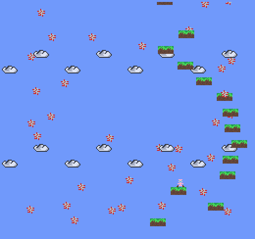

# Pandemic Escape!

Author: Jiwoo Yoo

Design: The surface of Earth is a real bad place right now...Luckily, the sky is
much better! Jump from platform to platform while dodging the virus particles,
get as high as you can!

Screen Shot:

How Your Asset Pipeline Works:

Sprites are passed to a function that will read them as pngs using functions from
load_save_png. Their palettes and tile is mapped and saved in that function.
Another function calls this multiple times for each asset. 
This function gets loaded for call_load_functions

How To Play:

Use the arrow keys to move.
Use the up arrow key to jump.
The game ends when the player catches the disease, or falls off the screen.
And it seems getting higher slows the infection of the disease? Food for thought.

Sources: All sprites were drawn by me.

This game was built with [NEST](NEST.md).

